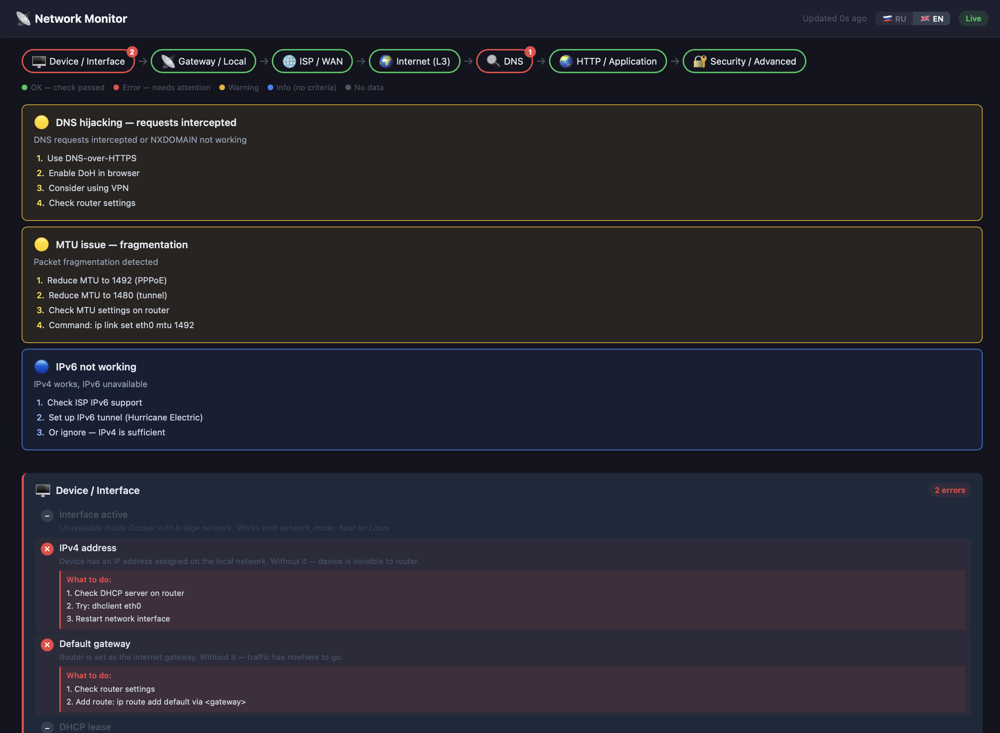

# home-network-monitor

Network diagnostic dashboard for your home server.
Shows the full packet path (Device → Router → ISP → Internet → DNS → HTTP → Security)
with 53 checks, automatic problem diagnosis, and fix instructions.

<!-- Screenshot placeholder -->
<!--  -->

## Features

- 53 network checks across 7 layers (Device/Interface, Gateway, ISP/WAN, Internet, DNS, HTTP, Security)
- Automatic diagnosis: detects ISP outages, DNS failures, packet loss, MTU issues, CGNAT, captive portals, and more
- Fix instructions for every failed check
- Real-time updates via WebSocket
- Latency history, jitter, packet loss statistics
- Speedtest (download/upload), public IP change detection, SSL certificate monitoring
- No cloud, no account — runs entirely on your home server

## Requirements

- Linux server (x86_64)
- Docker + Docker Compose

## Quick Start

```bash
git clone https://github.com/gpont/home-network-monitor
cd home-network-monitor
cp .env.example .env
docker-compose up -d
```

Open `http://your-server-ip:3201`

## Configuration

| Variable | Default | Description |
|---|---|---|
| `PORT` | `3201` | HTTP port the dashboard listens on |
| `DB_PATH` | `/app/data/monitor.db` | Path to the SQLite database inside the container |
| `SSL_HOSTS` | `google.com,cloudflare.com,github.com` | Comma-separated hostnames for SSL certificate checks |
| `IPERF3_SERVER` | — | IP of an iperf3 server for throughput testing (optional) |

Data is stored in `./data/` on the host — history is preserved across container restarts.

## Docker image

```
ghcr.io/gpont/home-network-monitor:latest
```

The container requires `network_mode: host` and `cap_add: NET_RAW` (for ICMP ping).
Both are pre-configured in `docker-compose.yml`.

## Development

Requirements: [Bun](https://bun.sh)

```bash
npm install           # install all dependencies

npm run dev           # start backend + frontend simultaneously
npm run dev:backend   # backend only  → http://localhost:3001
npm run dev:frontend  # frontend only → http://localhost:5173

npm run build         # build frontend into backend/public/
npm run typecheck     # TypeScript check
bun test              # run all tests
```

Backend dev server runs on port `3001`; the frontend Vite dev server proxies `/api` and `/ws` there.

## License

MIT
